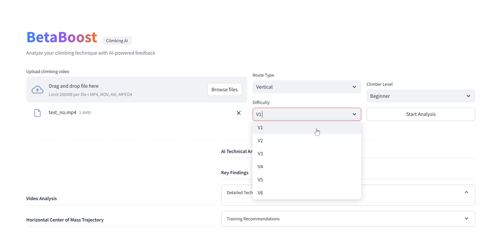
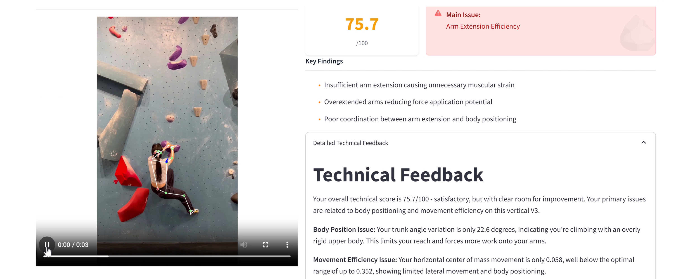
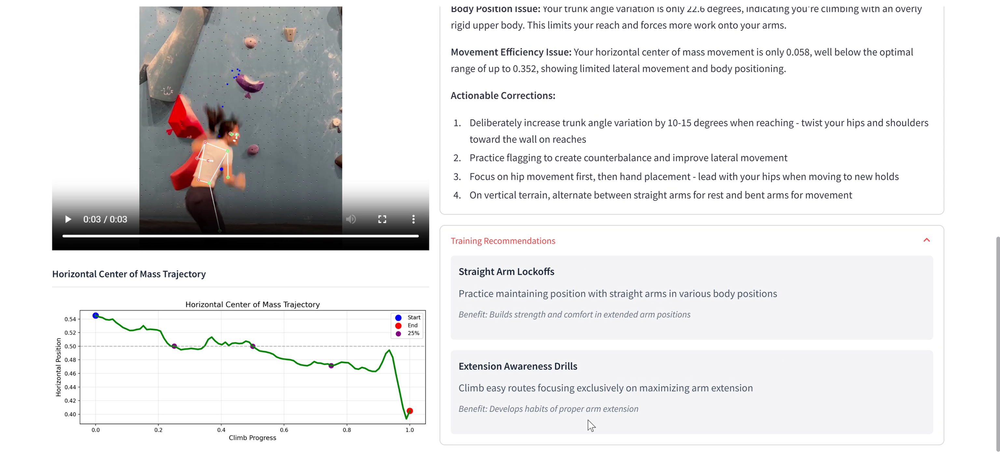

# 🧗‍♀️ BetaBoost: AI-Powered Climbing Coach

**BetaBoost** is an intelligent climbing feedback tool that analyzes climbing videos using pose estimation, biomechanical features, and expert-defined rules. The system generates real-time feedback and training suggestions to help climbers improve their technique—offering coaching insights at scale.

> “Climbing harder, but not climbing better.”  
> BetaBoost bridges that gap with intelligent, personalized, visual feedback.

---

## 🔍 Key Features

- 🎯 **Pose Estimation**: MediaPipe-powered keypoint tracking with 33 landmarks per frame
- 📊 **327 Biomechanical Features**: Joint angles, movement range, center of mass, balance, trunk angle, and more
- 🔁 **Dynamic Sampling**: Strategically samples and smooths pose data for multi-frame feature generation
- 🧠 **Rule-Based Evaluation System**: Encodes expert climbing principles to evaluate performance
- 🧮 **XGBoost Feature Ranking**: Identifies top 30 most important features based on labeled data
- 🤖 **Claude API Integration**: Converts numerical outputs into coach-style natural language feedback
- 🖥️ **Streamlit Web Interface**: Upload videos and get results interactively
- 📈 **Trajectory Visualization**: Shows CoM movement and movement efficiency indicators

---

## 📸 Product Walkthrough

### 🖼️ Upload Interface  
Users upload short climbing videos and input route type and difficulty.



---

### 🧠 Pose Detection + Summary Panel  
Real-time skeleton tracking overlaid on climbing video, along with scoring breakdown and main issue identification.



---

### 📊 Corrections, Training & Trajectory  
Displays horizontal center of mass trajectory, corrective suggestions, and drill recommendations.



---

## 🧰 Tech Stack

- **Language**: Python
- **CV & Keypoints**: MediaPipe
- **Modeling**: XGBoost, NumPy, Scikit-learn
- **Frontend**: Streamlit
- **Visualization**: Matplotlib, OpenCV
- **Natural Language**: Claude API by Anthropic
- **Other**: Pandas, Pillow, pyngrok

---

## 🚀 How to Run

Install requirements:

```bash
pip install -r requirements.txt
